# System Monitor Tool (C++)

A lightweight System Monitor written in C++17 that displays real-time information about running processes, memory usage, and CPU load - similar to the Linux 'top' command.

This project was built progressively over 5 days, adding one key feature each day - from basic system stats to real-time process monitoring with interactive controls.

------------------------------------------------------------
Features
------------------------------------------------------------
✅ Display system uptime, memory, and load average
✅ List all running processes with CPU and memory usage
✅ Sort processes by CPU or memory usage
✅ Kill processes interactively (SIGTERM or SIGKILL)
✅ Real-time refresh every few seconds (like 'top')
✅ Interactive ncurses-based terminal UI

------------------------------------------------------------
Project Objective
------------------------------------------------------------
Objective:
Create a C++ system monitor tool that displays real-time information about system processes, memory usage, and CPU load, similar to the 'top' command in Linux.

------------------------------------------------------------
Day-wise Progress
------------------------------------------------------------
Day 1: UI layout & system data — Displayed uptime, load average, and memory info.
Day 2: Process listing — Listed running processes with CPU jiffies and RSS memory.
Day 3: Sorting feature — Added sorting by CPU or memory (--sort=cpu / --sort=mem).
Day 4: Process control — Added interactive kill functionality (k / K commands).
Day 5: Real-time updates — Implemented ncurses-based UI, real-time refresh, CPU%% calculation, and live controls.

------------------------------------------------------------
Installation
------------------------------------------------------------
Prerequisites:
- Linux environment
- C++17 compiler (g++)
- ncurses library

Install dependencies (Ubuntu/Debian):
sudo apt update
sudo apt install g++ libncurses-dev

------------------------------------------------------------
Build and Run
------------------------------------------------------------
Build (Day 5 version):
g++ -std=c++17 sysmon.cpp -o sysmon -lncurses

Run:
./sysmon 2
(refreshes every 2 seconds; press 'q' to quit)

------------------------------------------------------------
Usage
------------------------------------------------------------
Key / Command | Function
-------------- | --------
s | Toggle sorting (CPU ↔ Memory)
k | Prompt for PID and send SIGTERM
q | Quit program
--sort=cpu | Command-line sort by CPU (default)
--sort=mem | Command-line sort by memory

Example:
./sysmon --sort=mem

------------------------------------------------------------
Git Commit Log (Example)
------------------------------------------------------------
git init
git add sysmon.cpp
git commit -m "Day 1: Basic UI layout and system info"
git commit -m "Day 2: Process listing with CPU jiffies and memory"
git commit -m "Day 3: Added sorting by CPU/memory"
git commit -m "Day 4: Interactive process kill functionality"
git commit -m "Day 5: Real-time ncurses-based system monitor"

------------------------------------------------------------
## 🖼️ Screenshots

💡 **Note:** Below are real outputs from the terminal showing how the tool evolved from **Day 1 → Day 5**.

---

### 🧭 Day 1 – Basic System Info
Displays basic system information such as uptime, load average, and memory usage.

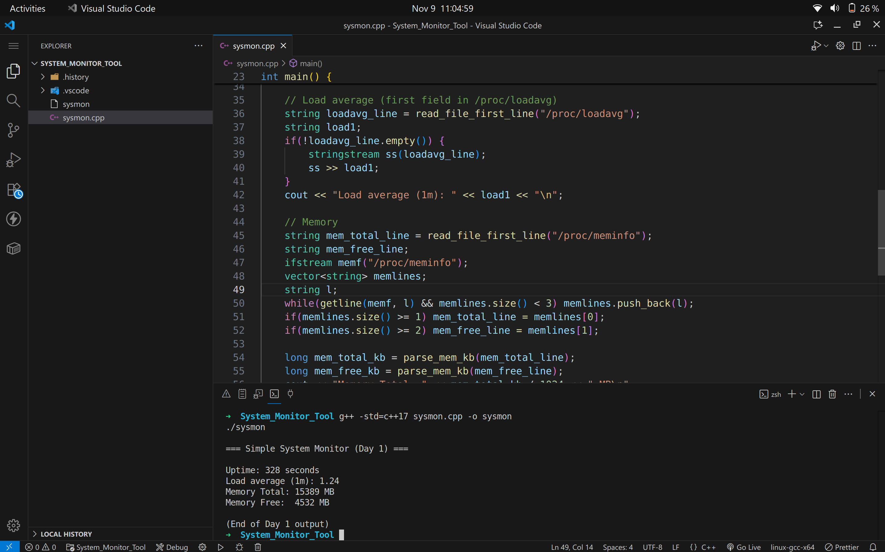

---

### ⚙️ Day 2 – Process Listing
Lists running processes along with PID, CPU jiffies, and memory (RSS).

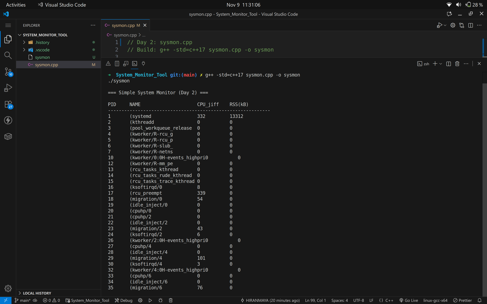

---

### 🧩 Day 3 – Sorted Process List
Shows process sorting by CPU and memory usage using `--sort=cpu` or `--sort=mem`.

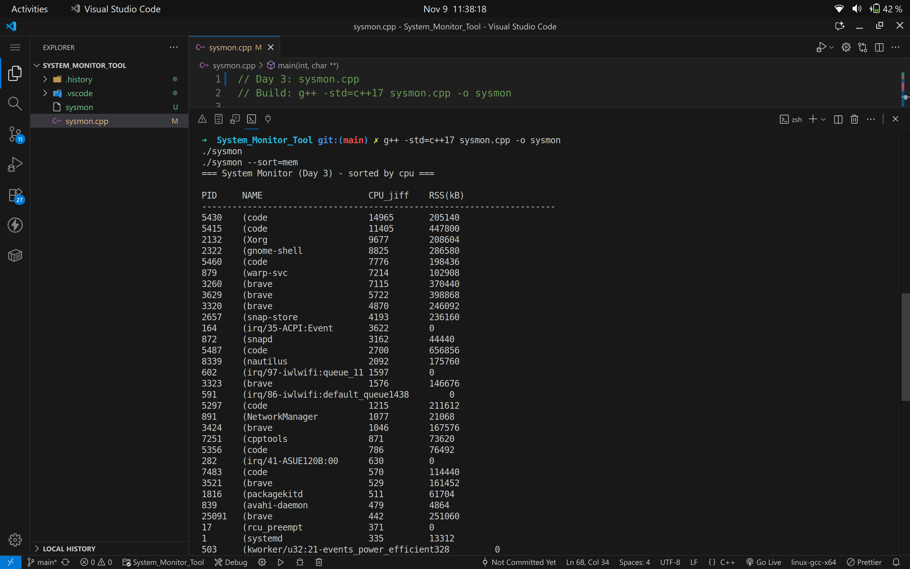  
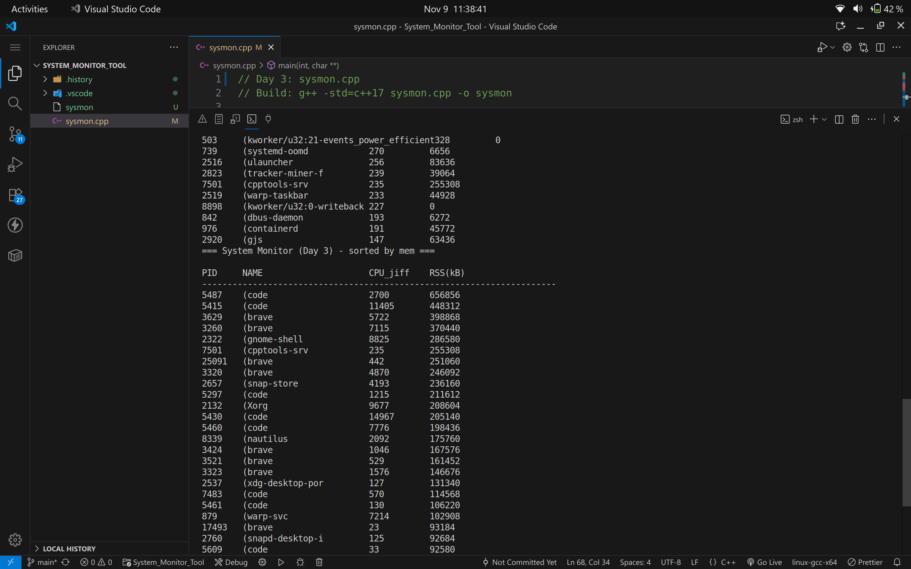

---

### 🧨 Day 4 – Kill Process Feature
Interactive commands (`k PID`, `K PID`) to terminate or force-kill a process.

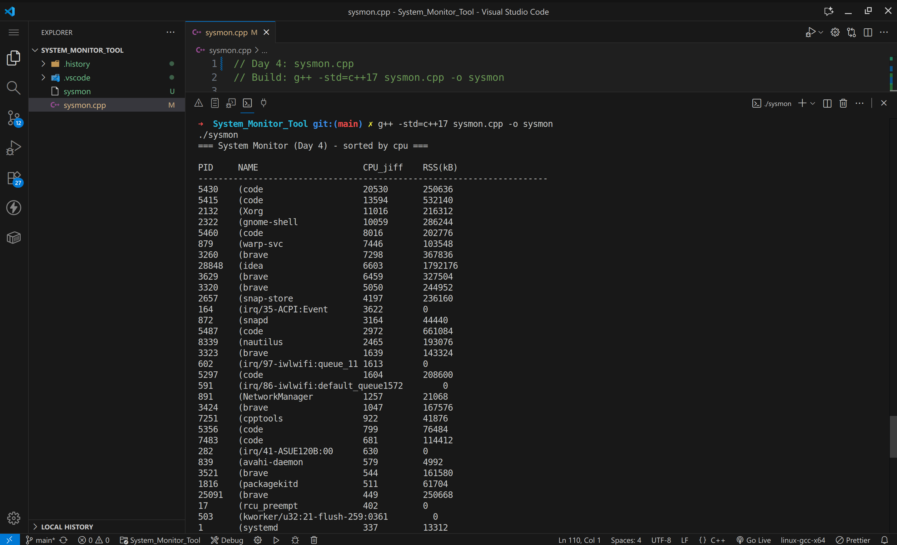  
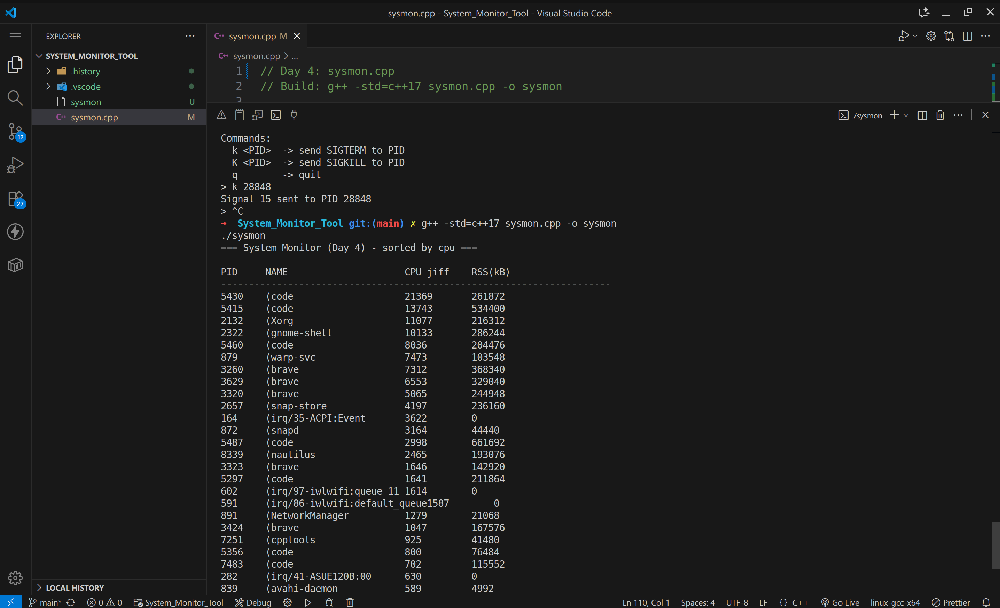  
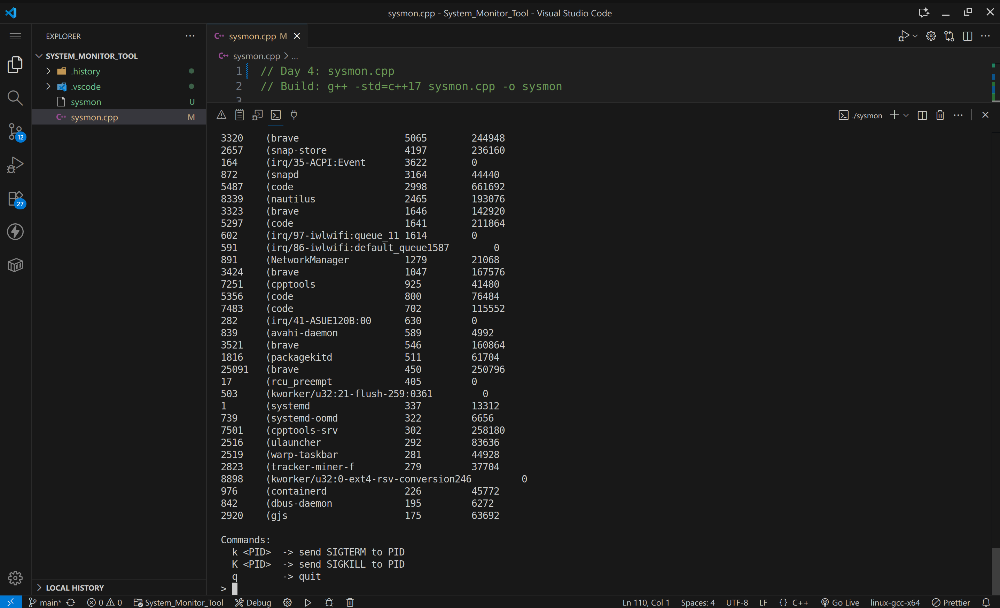

---

### 📊 Day 5 – Real-Time Monitor UI
A fully interactive ncurses-based interface with live CPU % and memory updates.

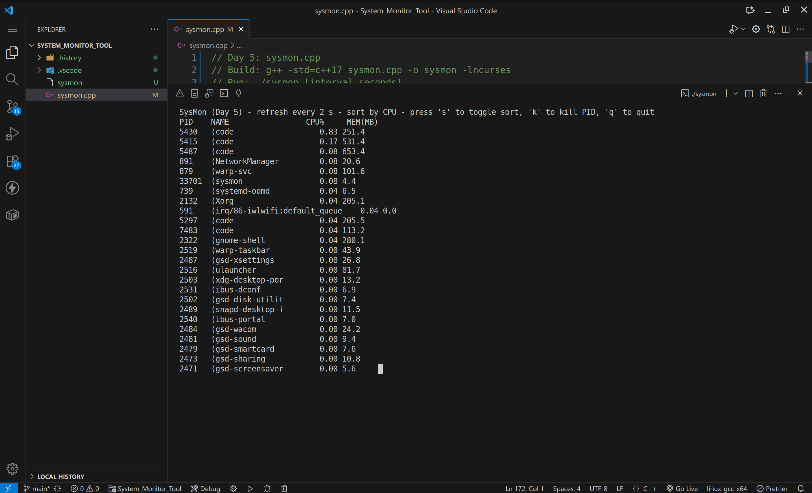  
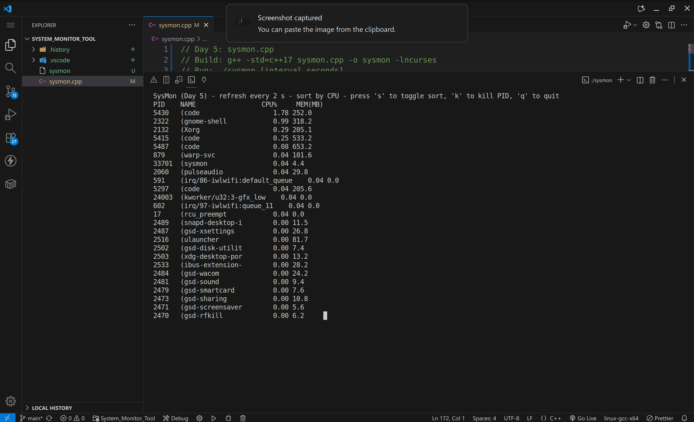  
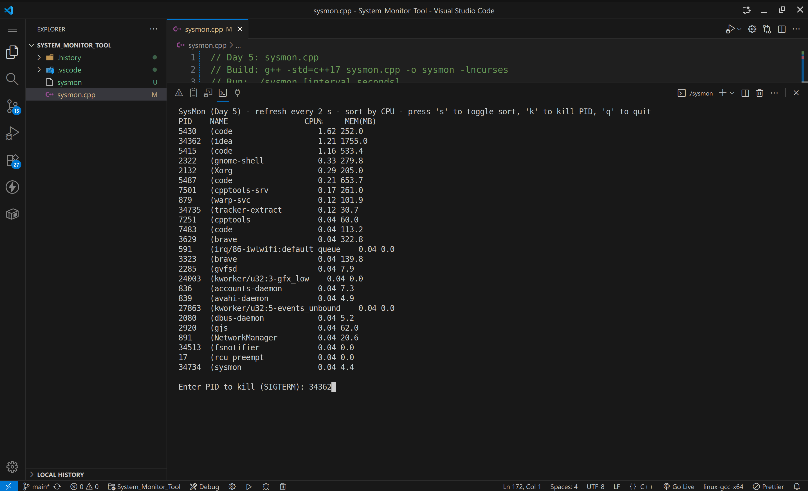  
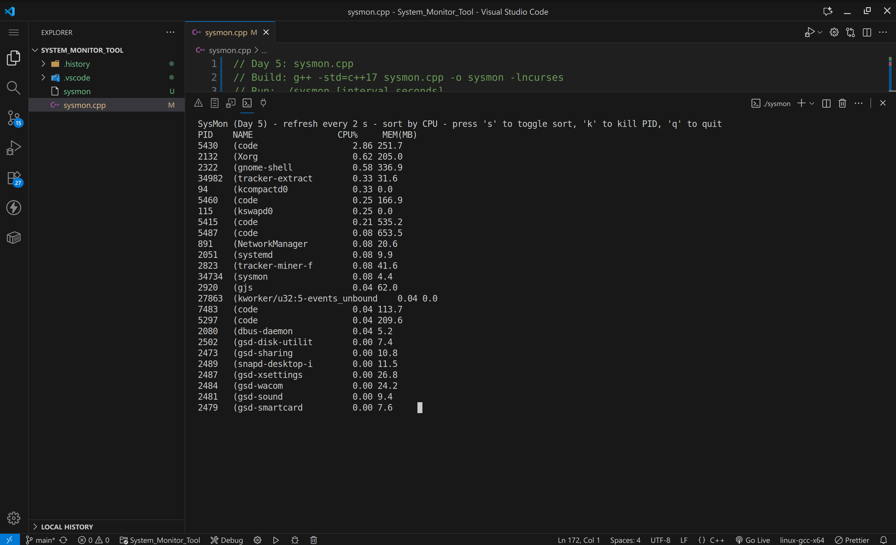

------------------------------------------------------------
License
------------------------------------------------------------
This project is open-source and available under the MIT License.

------------------------------------------------------------
Author
------------------------------------------------------------
VISHAL KUMAR MAHTO
Final Year B.Tech (COMPUTER SCIENCE AND ENGINEERING)
